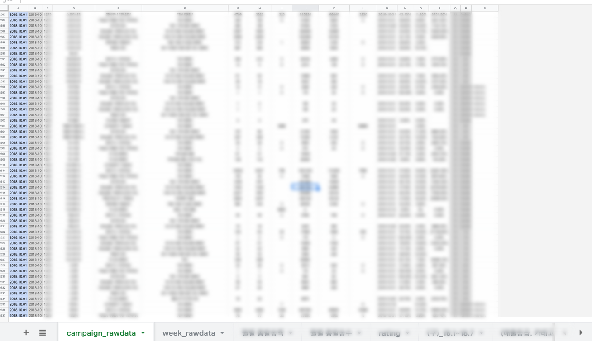
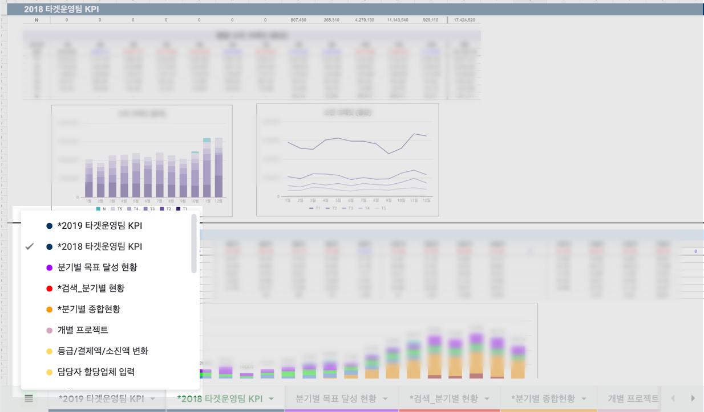

수백개의 쇼핑몰 고객사 데이터를 활용하기 위한 운영팀 데이터센터 구축

-----

### 방치된 양질의 데이터

- MAU 1천만명에 달하는 의미있는 고객사 데이터를 활용 하지 못하고 있음
- 운영에서 필요로 하는 조건에 따른 이용 현황을 한눈에 볼 수 없음

### 성과 관리를 위한 다양한 대시보드

- 매달 로우 데이터를 받아 엑셀(Excel)을 활용하여 분석

- KPI, 업체/등급별 분석, CS현황 분석 등 다양한 대시보드 작성

### 데이터로 판단

- 구체적으로 개선이 필요한 부분을 정확히 파악할 수 있게 됨
- 문제 개선 과정을 명확한 달성도 수치로 체크