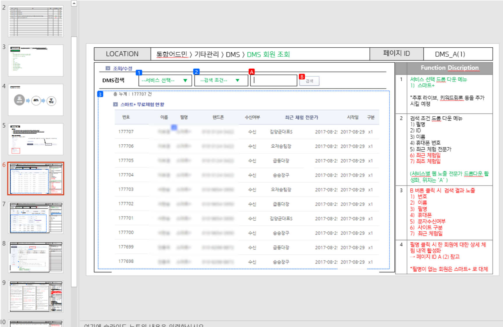

### 운영 리소스 손실

- 필수 루틴 업무인 메시지 발송을 일일이 수동으로 직접 발송해야 하는 문제
- 사람이 직접 처리하다보니 누락되거나 실수하는 일이 자주 발생

### 어드민 기능 기획

- 설정한 조건에 따라 메시지를 자동으로 발송하는 DMS(Direct Message System) 기획

### 생산성 증가

- 오발송이 없어지고 기존에 1시간 걸리던 일을 1분이 안되는 시간 안에 해결
- 콘텐츠 제작, 전문가 관리 등 생산적인 업무에 더 많은 시간을 할애할 수 있게 됨