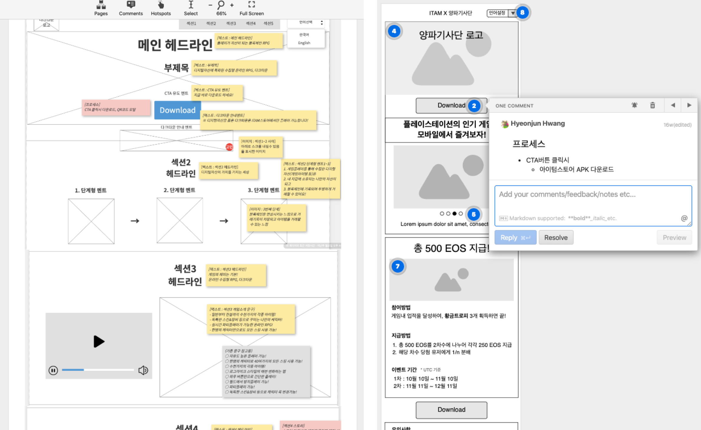
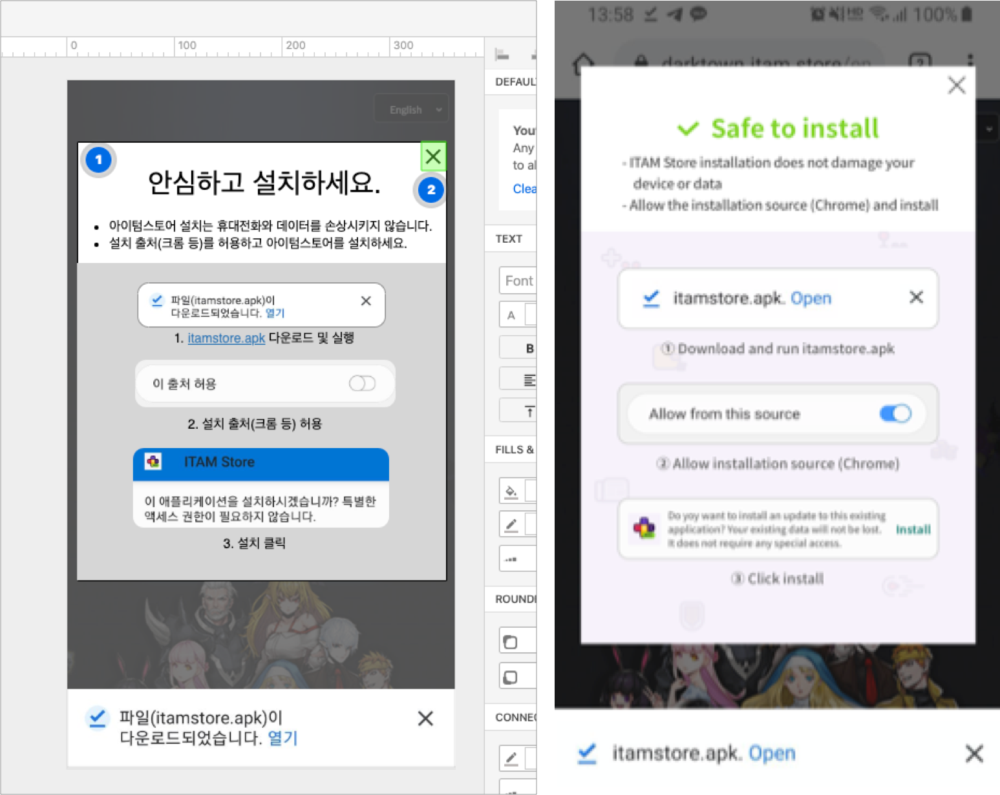

### 본격 마케팅

- 신규 마케팅 집행에 따라 사용자가 매력을 느낄만한 요소 고민
- 사용자가 접근하여 액션을 일으킬 수 있는 공간 필요

### 게임아 도와줘

- 게임을 내세워 스토어 앱(ITAM Store) 다운로드를 유도

(랜딩페이지 : <a href="https://darktown.itam.store" target="_blank">다크타운</a>, <a href="https://dp.itam.games" target="_blank">던전공주</a>, <a href="https://onionknights.itam.stor" target="_blank">양파기사단</a>, <a href="https://cryptofishing.itam.store" target="_blank">크립토피싱</a>)

### 혹시 전환율에 영향이?

- 모바일 환경에서 APK 설치시 출처 허용 메시지(디바이스 알럿) 때문에 전환율이 실제보다 낮을 것으로 예측
- 전체의 약 90%에 달하는 모바일 유입자의 전환율을 올리기 위해 APK 설치 가이드 기획 및 적용

