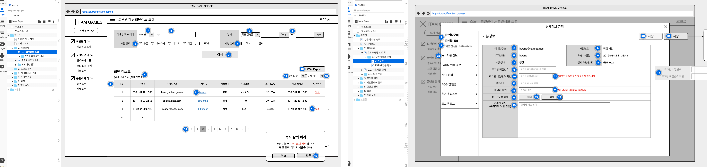
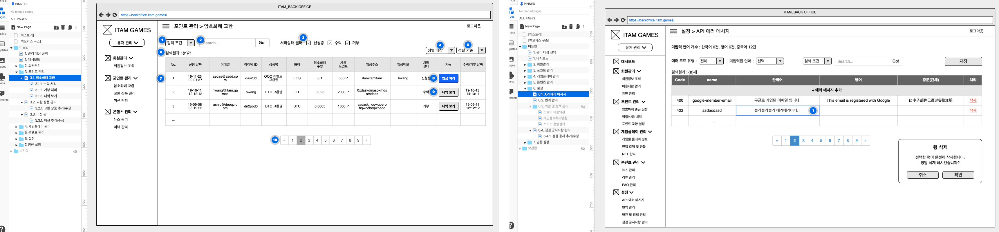

### 원활하지 못한 유저 관리

- 기존 백오피스는 엔드 유저 관리는 불가능했고 콘텐츠 관리는 제한적이었기 때문에 운영상 유저 문의에 대한 대응이 느리고 효율적이지 못한 문제
- 블록체인 특성으로 인해 프로덕트별 회원 정책이 조금씩 상이하여 통합 관리가 되지 않는 문제

### 자주 쓰는 것 먼저

- 공통 회원관리 영역과 프로덕트별 특수한 회원관리 영역 구분하여 기능 기획

- 운영상 추가 및 수정이 잦은 영역별 우선순위 정하여 제어 기능 추가
