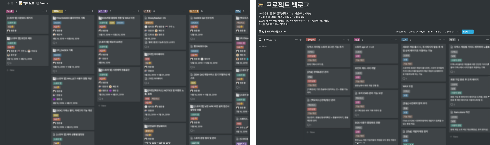
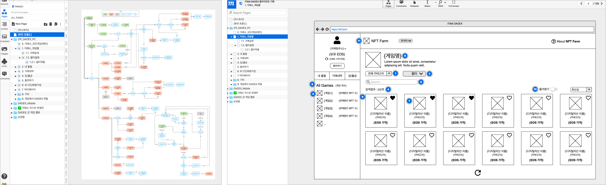
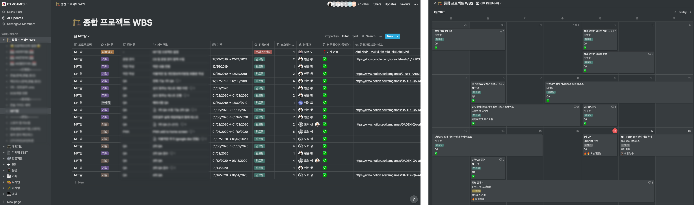
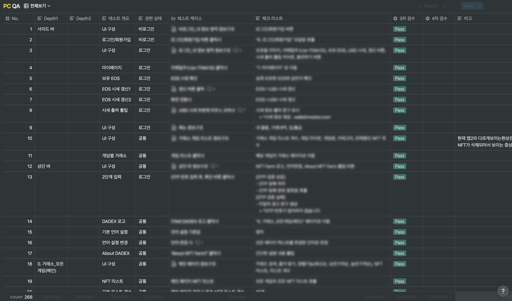
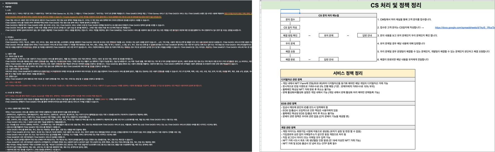
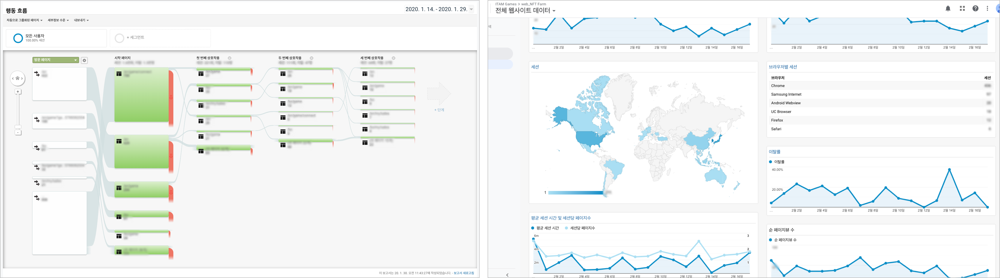
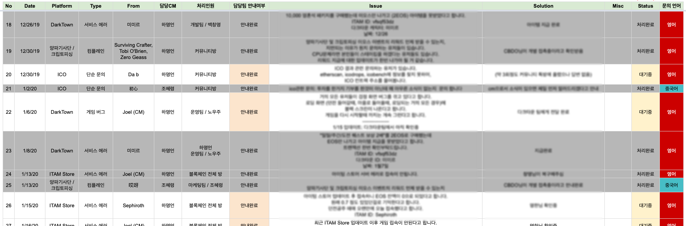

블록체인 게임 디지털자산 웹 거래소(<a href="https://nft.farm" target="_blank">NFT FARM</a>) 초기 기획 부터 런칭

## 문제 인식

#### SDK를 통한 거래소의 한계

- ITAM Store 콘솔에 등록된 게임만 SDK를 통해 디지털자산 거래소 제공 가능
- 게임 개발사 입장에서 자사 게임을 구글 플레이 스토어, 애플 앱스토어에 이어서 ITAM Store 콘솔까지 올리고자는 니즈가 약함
- 핵심이 되는 디지털자산 기능 제공에 대한 집중도가 떨어지는 문제

#### 손쉬운 웹 거래소

- 구글 플레이 스토어, 애플 앱스토어 등 어떤 플랫폼에서 서비스중인 게임이라도 적용 가능한 웹 형태의 거래소 제공
- 게임은 기존 플랫폼에서 관리하고 블록체인 디지털자산 관리만 손쉽게 등록/수정 가능하도록 설계

## 서비스 설계

#### 사전 분석

- 글로벌 해외 디지털자산 거래소 시장 및 레퍼런스 분석

#### 커뮤니케이션

- 프로젝트 백로그 및 프로젝트별 우선순위 관리
- 개발 및 디자인 요구사항 작성 후 미팅

#### 기획 문서 작성 및 리뷰

- 모든 기능과 정책을 정의하고 front와 back을 고려한 플로우차트 작성
- 프로토타이핑을 통해 기획 리뷰하며 스토리보드 작성 및 보완

## 서비스 구현

#### 프로젝트 진행 관리

- WBS 및 프로젝트 진행상태 관리를 통한 개발, 디자인, 마케팅 커뮤니케이션

#### QA

- 테스트 리스트 작성 및 진행

#### 운영 준비

- 운영에 필요한 개인정보처리방침, 이용약관, 운영정책, KPI, CS정책 등 작성

## 팔로우 업

#### 주요 지표 확인

- 데이터를 통해 KPI 또는 사용자 경험이 떨어지는 부분 팔로우 업

#### 운영 이슈 대응

- CS 채널을 통해 사용자 경험을 높일 수 있는 기능과 콘텐츠를 고민
- 운영상 발생하는 불편사항이나 오류를 지속적으로 관리

