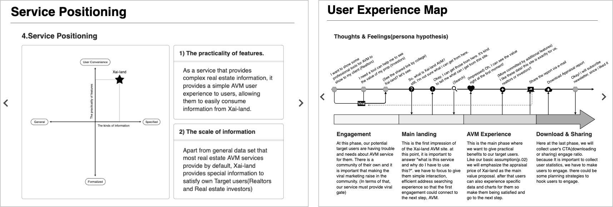
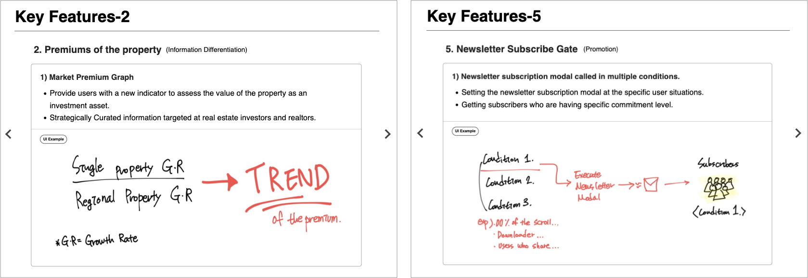
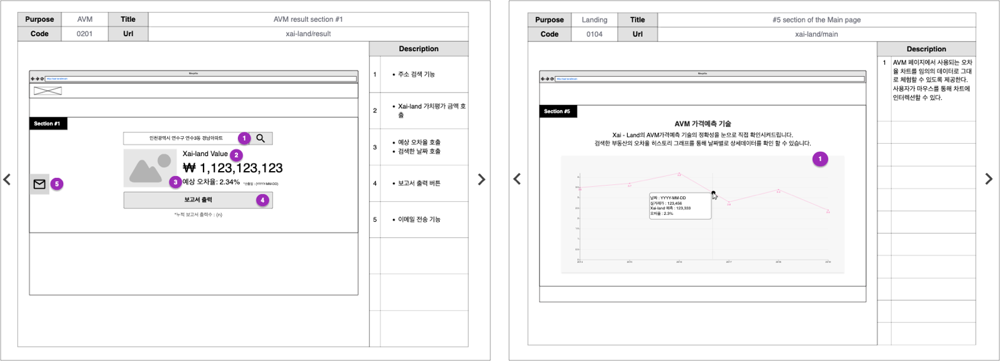
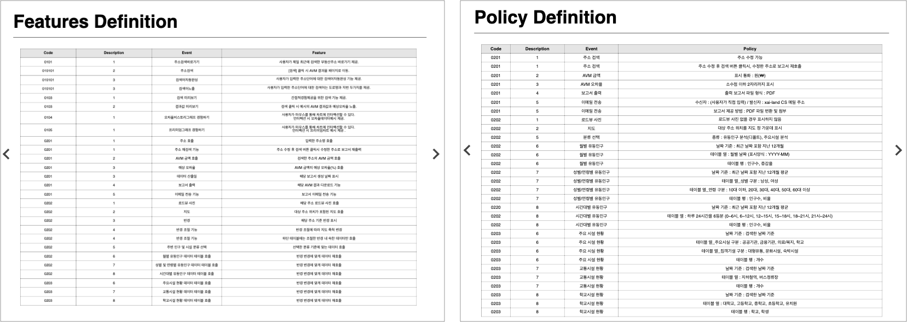

서비스 기획 스터디를 목적으로 실제 프롭테크 스타트업(<a href="https://xai.land" target="_blank">XAI Ladn</a>) 서비스를 외주 형태로 기획

### 스터디의 시작

- 팀을 구성하여 각자 역할을 분담하여 아이디어 수집 부터 최종 기획안 까지 작성

### 인사이트 도출

- 서비스의 타겟 고객층과 포지셔닝을 정의하고 사용자여정지도 작성

### 핵심 피쳐 기획

- 인사이트를 통해 XAI Land만의 차별화된 핵심 피쳐 선정

### 서비스 페이지

- 회사 소개 메인 홈페이지와 서비스 페이지 기획

- 기능 및 정책 정의서 작성

